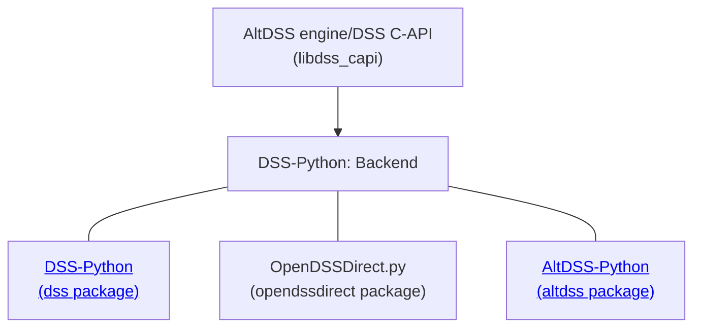

# OpenDSSDirect.py

[](https://pypi.python.org/pypi/OpenDSSDirect.py/)   

OpenDSSDirect.py is a cross-platform Python package implements a "direct" library interface to [our customized implementation](https://github.com/dss-extensions/dss_capi) of [OpenDSS](http://smartgrid.epri.com/SimulationTool.aspx) using [DSS-Python](https://dss-extensions.org/dss_python/).
OpenDSS is an open-source electric power distribution system simulator [distributed by EPRI](https://sourceforge.net/p/electricdss/). 

OpenDSSDirect.py is part of DSS-Extensions, a larger effort to port the original OpenDSS to support more platforms (OSs, processor architectures), programming languages, and extend both the OpenDSS engine and API, represented in the AltDSS engine:

<p align="center">
    
</p>

*As a reminder, although very compatible, this project is not supported by EPRI.*

See [OpenDSSDirect.jl](https://github.com/dss-extensions/OpenDSSDirect.jl) for a similar package in Julia, and for more context about this project and its components (including alternatives in MATLAB, C++ and C#/.NET), please check [https://dss-extensions.org/](https://dss-extensions.org/) and our hub repository at [dss-extensions/dss-extensions](https://github.com/dss-extensions/dss-extensions) for more documentation, discussions and the [FAQ](https://github.com/dss-extensions/dss-extensions#faq).

<center>



</center>

Both OpenDSSDirect.py and DSS-Python expose the classic OpenDSS API (closer to the COM implementation). For an alternative API which exposes all OpenDSS objects, batch operations, and a more intuitive API, check [AltDSS-Python](https://dss-extensions.org/AltDSS-Python/). If required, users can mix all three packages in the same project to access some of their unique features.

<!-- TODO: update the links to the final links after the main site is updated -->

## Troubleshooting

It is recommended to use `conda` to install pandas, which is currently a dependency of this package.
This package interfaces with OpenDSS using the "direct" library interface, so a good understanding of OpenDSS will help troubleshooting.

If you are having issues using this Python interface, feel free to open an Issue on GitHub [here](https://github.com/dss-extensions/OpenDSSDirect.py/issues/new). 

For issues specific to DSS-Extensions, users are welcome to post at the [Discussions](https://github.com/orgs/dss-extensions/discussions) page from DSS-Extensions. For general OpenDSS questions, the [official OpenDSS forum](https://sourceforge.net/p/electricdss/discussion/) is very useful.

The official repository for OpenDSSDirect.py is hosted at https://github.com/dss-extensions/OpenDSSDirect.py/

## Acknowledgments

Thanks to @tshort, Davis, @temcdrm, @GordStephen, @Muxelmann and @PMeira for their contributions, as well as all the users for their valuable feedback. Thanks to EPRI for providing OpenDSS to the power systems community.

See also our repositories for [DSS-Python](https://github.com/dss-extensions/dss_python) for the underlying Python package used in this package, and 
[DSS C-API](https://github.com/dss-extensions/dss_capi) for the modified and extended OpenDSS codebase used in DSS-Extensions.

## Documentation

The documentation pages are organized as follows.

<!-- TODO: add relevant code to allow running notebooks on e.g. Colab -->

```{toctree}
:maxdepth: 1
:caption: General
self
notebooks/Installation
notebooks/GettingStarted
updating_to_0.9
```

```{toctree}
:maxdepth: 1
:caption: Examples
notebooks/Example-OpenDSSDirect.py
notebooks/ActiveClass
Plotting voltage profile <notebooks/VoltageProfilePlot>
Circuit SystemY <notebooks/SystemY>
Multithreading, multiple DSS engines <notebooks/Multithreading>
```

```{toctree}
:maxdepth: 1
:caption: API Reference
opendssdirect <opendssdirect>
opendssdirect.utils <opendssdirect_utils_ref>
opendssdirect.enums <enumerations>
```

```{toctree}
:maxdepth: 1
:hidden:
:caption: External links
GitHub repository <https://github.com/dss-extensions/OpenDSSDirect.py>
Package on PyPI <https://pypi.python.org/pypi/OpenDSSDirect.py/>
Test/example circuits <https://github.com/dss-extensions/electricdss-tst>
DSS-Extensions/FAQ <https://github.com/dss-extensions/dss-extensions#faq>
DSS-Python <https://dss-extensions.org/dss_python>
AltDSS-Python <https://dss-extensions.org/AltDSS-Python/>
DSS-Extensions Discussions <https://github.com/orgs/dss-extensions/discussions>
OpenDSS forum <https://sourceforge.net/p/electricdss/discussion/>
OpenDSS documentation <https://opendss.epri.com/opendss_documentation.html>
```


# Indices and tables

* [](genindex)
* [](modindex)
* [](search)
