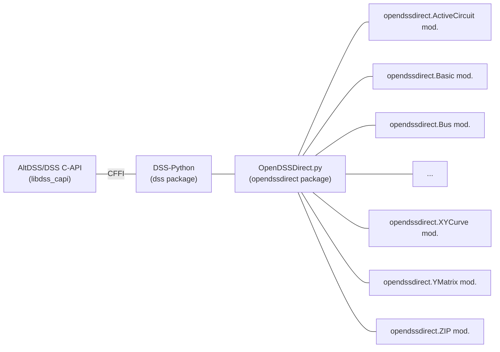
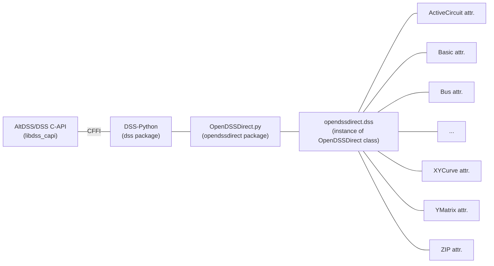
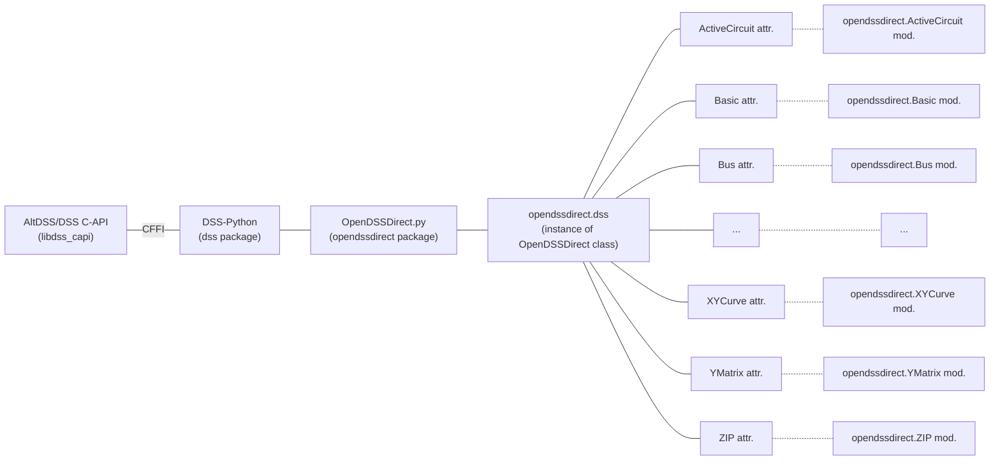

# Upgrading to OpenDSSDirect.py v0.9+

If you are using older OpenDSSDirect.py versions, some specifics changed in v0.9 are important to note. For general changes of the DSS engine, please see the changelog at https://github.com/dss-extensions/dss_capi/blob/master/docs/changelog.md#version-0140

Basic usage of ODD.py can continue as in previous versions, and should mostly keep working out-of-the-box if you do not intend to use multiple DSS instances.
There are also a couple of deprecation warnings introduced to signal some changes to the users.

- Instead of using `import opendssdirect as odd`, we now recommend `from opendssdirect import dss as odd`. This will import a class instance, which exposes more features and is safer. For example, the main class (`OpenDSSDirect`) exposes the `OpenDSSDirect.Text.Commands` as the call operator -- you can use `odd('redirect some_script.dss')`, even with multi-line strings.

- The classes also handle a common mistake of new users, which is using OpenDSSDirect.py as DSS-Python or the COM API, accidentally replacing the functions/methods with the intended values instead. That is, something like `from opendssdirect import dss as odd; odd.Text.Command = 'clear'` now results in an error.

- The old `Iterator` class is deprecated since all iterable classes should now support the native iterator protocol in Python. That is `[load.kW() for load in odd.Loads]` now works. Limitations from OpenDSS still applies (a single object of a certain type must be active, etc.).

- `opendssdirect.run_command` is also deprecated due to the lack of direct error handling. We noticed this was resulting in error being ignored by many users, especially new users. 

- Multiple DSS engines are now supported, including multi-threading in Python. This means that some old usage patterns are not recommended anymore, since the code moved from plain modules to classes in order to allow this kind of feature.

```python
from opendssdirect import dss as odd_default

# When using multiple contexts, it's better avoid changing the 
# working directory of the process
odd_default.Basic.AllowChangeDir(False)

odd1 = odd_default.NewContext()
odd2 = odd_default.NewContext()

odd1('new circuit.circuit1')
odd2('new circuit.circuit2')

assert odd1.Circuit.Name() == 'circuit1'
assert odd2.Circuit.Name() == 'circuit2'
```

- The package now has the option of returning NumPy arrays (like DSS-Python) instead of plain lists. As of v0.9, this is not enabled by default, but it could be in future versions (feedback is welcome). To enable it globally, you can set the environment variable `OPENDSSDIRECT_PY_USE_NUMPY=1`. To enable it on a per-instance base, you can pass `prefer_lists=False` to the constructor. For example, from one of the tests:

```python
from opendssdirect.OpenDSSDirect import OpenDSSDirect
from numpy import ndarray

# NOTE: this constructors ALWAYS binds to the default DSS engine.
odd_np = OpenDSSDirect(prefer_lists=False)
# Use it normally
odd_np(f"Redirect '{PATH_TO_DSS}'")
assert isinstance(odd_np.Circuit.AllBusMagPu(), ndarray)

odd_lst = OpenDSSDirect(prefer_lists=True)
# Same global instance, we can just reuse the result
assert isinstance(odd_lst.Circuit.AllBusMagPu(), list)
```

- Due to changes in the AltDSS/DSS C-API engine, the capitalization of the DSS properties was changed. OpenDSS is case insensitive, but a lot of third-party code assumes a certain capitalization. This is not recommended since OpenDSS already changed the capitalization in the past. Code that relied on the capitalization before should stop working, but we added a way to toggle the capitalization style through `Settings.SetPropertyNameStyle`, as in the snippet below. We'd recommend using this but updating any related code to not depend on the capitalization at all. Note that there is also `DSSPropertyNameStyle.Lowercase` which may simplify some comparisons.

```python
from opendssdirect import dss as odd, enums as dss_enums
odd.Settings.SetPropertyNameStyle(dss_enums.DSSPropertyNameStyle.Legacy)
```

## Architecture of version 0.9

Previous versions of OpenDSSDirect.py only exposed the default OpenDSS engine instance, as that was the how the original OpenDSS worked. With just a single instance, modules used to fit nicely to map the interfaces:



To allow multiple instances and other desirable features like pythonic iteration, indexing, `len()`, etc., a new [`OpenDSSDirect class`](opendssdirect.OpenDSSDirect.OpenDSSDirect) was introduced, and the original modules were replaced with instances of dedicated classes:



Finally, to provide better backwards compatibility, in case users imported separate modules directly, the methods bound to the default DSS engine instance/context are exposed in the original module organization.



In the end, importing the default instance is enough to provide the new features:

```python
from opendssdirect import dss
```

In the long term, the modules could be removed if the community does indeed migrate to the import above. Typically, replacing `import opendssdirect as dss` with `from opendssdirect import dss` is enough.

The design mirrors the basics of what was done in DSS-Python 0.12 (July 2022) when support for DSSContexts (multiple engines) was introduced, with the caveat that DSS-Python already used a class-based approach. After a few releases, the design seems fit and stable to port over to ODD.py. Besides the extras, especially [`opendssdirect.utils`](opendssdirect.utils), ODD.py is effectively equal to DSS-Python using a different convention, that is, instead of using Python properties like DSS-Python (done to achieve drop-in compatibility with the official COM implementation), OpenDSSDirect.py uses function calls for setters and getters.

For backwards compatibility, and to respect users expectations, OpenDSSDirect.py doesn't allow/recommend using the constructor of the main interface class directly. Instead, [`NewContext`](OpenDSSDirect.NewContext) must be used.

## Using OpenDSSDirect.py with DSS-Python and AltDSS-Python

Two new functions were introduced to make it easier to map from one module to the other:

- [`OpenDSSDirect.to_dss_python`](OpenDSSDirect.to_dss_python)
- [`OpenDSSDirect.to_altdss`](OpenDSSDirect.to_altdss)

This is especially useful now that `altdss` exposes most of the classic API in a more pythonic approach, batches and more.

```{note}
See also [DSS-Python](https://dss-extensions.org/dss_python/) and [AltDSS-Python](https://dss-extensions.org/AltDSS-Python/).
```

## A multi-threading example

An example of how to use multiple DSS instances and multi-threading, directly in Python, is available at [Multiple DSS engines and multithreading](#notebooks/Multithreading). This would be recommended for most uses instead of the internal/classic [Parallel interface](opendssdirect.Parallel.IParallel).
